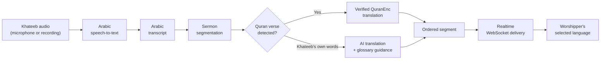
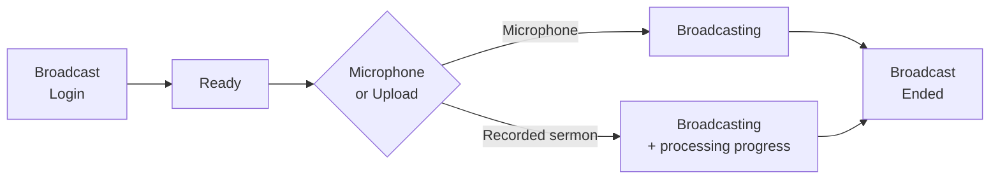
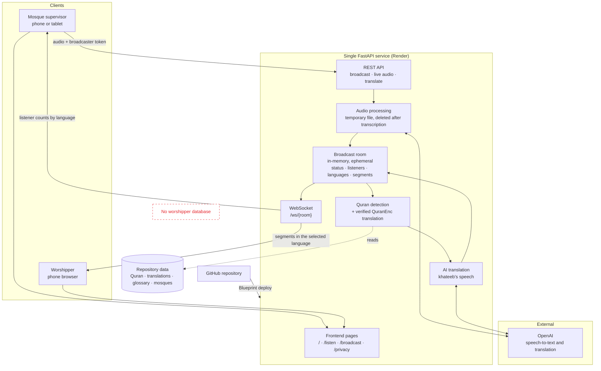

<div align="center">


# Minbar — منبر

**Live multilingual access to the Friday sermon.**

[](LICENSE)
[](render.yaml)
[](requirements.txt)
[](render.yaml)
[](docs/screens.md)

</div>

Minbar delivers the Friday sermon (khutbah) to worshippers in real time, in the language they understand. The khateeb speaks in Arabic as usual. Minbar transcribes his speech and streams each sentence to worshippers' phones in **English, Urdu or Hindi**, or as **Arabic text** for hearing-impaired worshippers. Quranic verses are never paraphrased by a general-purpose AI: they appear in Uthmani script with a **verified translation from QuranEnc**. Worshippers need no account, and none of their personal data is collected.

---

## Contents

[Overview](#overview) · [Key Features](#key-features) · [How Minbar Works](#how-minbar-works) · [User Experience](#user-experience) · [Supported Languages](#supported-languages) · [AI and Translation Safety](#ai-and-translation-safety) · [Technology Stack](#technology-stack) · [System Architecture](#system-architecture) · [Privacy by Design](#privacy-by-design) · [Project Screens](#project-screens) · [Evaluation and Testing](#evaluation-and-testing) · [Deployment](#deployment) · [Local Development](#local-development) · [Repository Structure](#repository-structure) · [Security and Reliability](#security-and-reliability) · [Limitations](#limitations) · [Documentation](#documentation) · [License](#license)

---

## Overview

The Friday sermon is the weekly address of the mosque: guidance, reminders and teaching delivered to the whole congregation. In many mosques, a large share of the worshippers don't understand Arabic, the language of the sermon. They're present, but the message doesn't reach them.

### The Problem

- Worshippers who don't speak Arabic follow the prayer but can't understand the sermon itself.
- Hearing-impaired worshippers face the same barrier even when Arabic is their language.
- General-purpose machine translation isn't appropriate for Quranic verses: translations of the meanings of the Quran must come from recognised, attributable sources.
- Any solution has to work inside a real mosque: no setup for worshippers, nothing for the khateeb to operate, and respect for worshippers' privacy.

### The Solution

A mosque supervisor places a phone or tablet near the khateeb and starts a broadcast. Minbar converts the Arabic speech to text and splits it into sentences. Each sentence is checked against the Quran text:

- **Quranic verses** are displayed in Uthmani script with their verified QuranEnc translation.
- **The khateeb's own words** are translated by AI, guided by a glossary of religious terms.

Worshippers open a link, choose a language and follow the sermon live on their own phone.

---

## Key Features

| | Feature | What it does |
|---|---|---|
| 🎙️ | **Live sermon broadcasting** | The supervisor broadcasts from the device microphone, or publishes a recorded sermon as a live feed |
| 🗣️ | **Arabic speech processing** | Arabic speech-to-text, filtering of silence artefacts and unusable output, and sentence segmentation |
| 🌐 | **Multilingual translation** | The khateeb's speech is translated into English, Urdu and Hindi in parallel |
| 📖 | **Quran verse detection** | Deterministic matching against the full Quran text, including partial quotations inside the khateeb's sentences |
| ✅ | **Verified Quran translations** | Detected verses use QuranEnc translations, shown with the translator and version |
| ⚡ | **Realtime WebSocket delivery** | Sentences reach every worshipper in the order they were spoken |
| 👥 | **Listener language tracking** | The supervisor sees the number of worshippers per language, live |
| 🔄 | **Broadcast states** | Every mosque room moves through `READY → LIVE → ENDED` |
| 📶 | **Reconnection handling** | After a dropped connection, worshippers reconnect automatically and receive the sentences they missed, without duplicates |
| 🗑️ | **Temporary audio processing** | Sermon audio exists only as a temporary file for one transcription request |
| 🔒 | **Privacy-first design** | No worshipper accounts, database or personal data |
| 🛠️ | **Mosque supervisor controls** | Secret broadcast code, microphone check, start/stop, takeover from another device, live statistics |
| 📜 | **Sermon replay** | The full transcript can be re-read in any supported language while the server retains it (2 hours after the sermon by default) |

---

## How Minbar Works



1. **Capture.** Live audio is recorded in chunks of 6 seconds by default. Each chunk is a complete audio file. A recorded sermon is uploaded as a single file.
2. **Speech-to-text.** The audio is transcribed as Arabic, and the temporary file is deleted as soon as the request completes.
3. **Segmentation.** The transcript is grouped into sentences. If no sentence-ending punctuation arrives within two chunks, the buffered text is published anyway so worshippers aren't left waiting.
4. **Quran detection.** Each sentence is matched against the 6,236 verses of the Quran.
5. **Translation.** Verses take their verified translation. The khateeb's words, including any commentary around a quoted verse, are translated by AI.
6. **Delivery.** Segments are built in parallel but published in order, and each worshipper reads them in the selected language.

---

## User Experience

The interface is Arabic-first and right-to-left, with Urdu also right-to-left and English and Hindi left-to-right. It's designed for phones and also works on tablets and desktops.

### Worshipper Flow


| Screen | Purpose |
|---|---|
| **Home** | Entry point for worshippers and mosque supervisors |
| **Welcome** | Rotating multilingual greeting, with the mosque's name and location |
| **Language Selection** | Arabic (sermon text), Urdu, English or Hindi. The choice lasts for the browser session |
| **Waiting** | Shown until the broadcast starts, with a connection indicator |
| **Live Translation** | Live sermon log with Quran cards, hadith badges and unclear-segment cards; the latest sentence is highlighted; adjustable font size; a button to jump back to the latest sentence |
| **Sermon Ended** | Closing supplication and a translation-clarity rating that stays on the device |
| **Replay** | The full sermon transcript in the selected language |

**Handled states:**

- **Connection lost:** a reconnecting banner appears, earlier cards fade, and the page reconnects automatically.
- **Invalid mosque link:** a clear message replaces the waiting screen.
- **Language change:** possible at any time, without reconnecting.

### Mosque Supervisor Flow



| Screen | Purpose |
|---|---|
| **Broadcast Login** | Select the mosque and enter the secret broadcast code; the khateeb's name is optional |
| **Ready** | Choose microphone or recording, run a live microphone level check, see waiting worshippers per language |
| **Broadcasting** | Elapsed time, audio level, detected Arabic text, listeners per language, processing status, stop button |
| **Processing progress** | For a recorded sermon, the Broadcasting screen shows upload, transcription and publishing progress |
| **Broadcast Ended** | Duration, peak listeners, verified verses, unclear segments, and a link to the transcript |

| Error state | Behaviour |
|---|---|
| Invalid broadcast code | Field highlighted, message «الرمز غير صحيح.» |
| Microphone permission denied | Three-step iPhone/iPad guide, retry, or switch to a recorded sermon |
| Page not served over HTTPS | Explains that the microphone requires a secure connection |
| Broadcast already live | Offers to continue the broadcast from the current device |
| Network interruption | Audio chunks queue and resend automatically |
| Failed audio segment | Retried, then skipped; the broadcast continues |
| Empty, unsupported or oversized file | Clear message with the reason |

---

## Supported Languages

| Language | Code | Role | Direction | Quranic verses | Khateeb's speech |
|---|---|---|---|---|---|
| **Arabic** | `ar` | Source language, also shown as text for hearing-impaired worshippers | RTL | Uthmani text | Arabic transcript |
| **English** | `en` | Translation target | LTR | QuranEnc: al-Hilali & Khan | AI translation |
| **Urdu** | `ur` | Translation target | RTL | QuranEnc: Junagarhi | AI translation |
| **Hindi** | `hi` | Translation target | LTR | QuranEnc: Azizul-Haq al-Omari | AI translation |

---

## AI and Translation Safety

Minbar uses AI where it helps, and keeps it out of places where accuracy can't be compromised.

| Task | Method |
|---|---|
| Arabic speech-to-text | OpenAI transcription model (`whisper-1` by default, configurable) |
| Quran verse detection | Deterministic text matching against the Quran corpus. **No AI** |
| Quran verse translation | Verbatim lookup in the QuranEnc translation files. **No AI** |
| Translation of the khateeb's speech | OpenAI model (`gpt-5-mini` by default, configurable) with glossary guidance |
| Religious terminology | Glossary terms found in a sentence are passed to the model, and the output is checked against the glossary |
| Hadith label | A simple text rule shows "Hadith as cited by the khateeb". The hadith itself is **not** verified |

**Why verses bypass the AI translation path.** Translations of the meanings of the Quran are scholarly works. Minbar normalises the transcript (diacritics and letter variants) and matches it against the King Fahd Complex Quran text:

- **Whole sentences** are matched with a similarity threshold of 90.
- **Partial quotations** inside commentary are found with a word-shingle index. To avoid presenting common Quranic phrases as a specific citation, a short fragment is accepted only when it is distinctive.

When a verse is found, its translation is read directly from the QuranEnc file and shown with the source, translator and version. Only the khateeb's surrounding words go to the AI.

**Human review still matters:**

- AI translations are always labelled as machine translation, with the khateeb's words as the reference.
- A verse with too many speech-to-text errors may go undetected, and is then translated as regular speech.
- The terminology glossary has not yet had a formal religious review.

---

## Technology Stack

| Area | Technologies |
|---|---|
| **Frontend** | HTML, CSS and vanilla JavaScript (no build step), SVG icon sprite, Google Fonts (Tajawal, Inter, Noto Nastaliq Urdu, Noto Sans Devanagari, Amiri Quran) |
| **Backend** | Python, FastAPI, Uvicorn, python-multipart, python-dotenv |
| **AI** | OpenAI Python SDK: audio transcription and the Responses API |
| **Realtime** | WebSockets via FastAPI/Starlette |
| **Validation** | Pydantic request models, audio type and size checks, glossary checks (`validate.py`) |
| **Data** | King Fahd Complex Quran JSON (Hafs, v30), QuranEnc translation JSON, terminology glossary JSON, mosque directory JSON, RapidFuzz for verse matching |
| **Deployment** | Docker, Render Blueprint (`render.yaml`) |
| **Testing** | pytest, HTTPX with the FastAPI TestClient |

---

## System Architecture



- **One service, one URL.** Frontend, REST API and WebSocket share an origin. Pages use `wss://` automatically when served over HTTPS.
- **Ephemeral rooms.** Rooms exist only for mosques listed in `data/mosques.json`. Each room holds its status, broadcast session, a random broadcaster token, connected sockets with their language, and the segments of the current session.
- **Ordered delivery.** Segments are processed concurrently but published strictly in order. Results from a previous broadcast session are discarded.
- **Reconnect contract.** A reconnecting client sends the last segment it received and its session id, and gets only what it missed.

Details: [`docs/architecture.md`](docs/architecture.md) · API and message formats: [`docs/contract.md`](docs/contract.md)

---

## Privacy by Design

| Principle | Implementation |
|---|---|
| **No worshipper accounts** | Worshippers open a link and choose a language. There is no sign-up and no password |
| **No worshipper database** | The service has no database. Room state lives in server memory only |
| **No personal information** | No names, phone numbers, email addresses or listening history are requested or stored |
| **No worshipper audio** | Worshippers' devices only receive text; they never send audio |
| **Temporary sermon audio** | Each audio upload is written to a temporary file for one transcription request and deleted afterwards |
| **Ephemeral broadcast state** | Listener counts and transcripts are held in memory. Transcripts are cleared 2 hours after a broadcast ends (configurable) or on restart |
| **Session-only preference** | The worshipper's language is stored in the browser's `sessionStorage` and cleared when the tab closes |
| **Minimal logging** | Logs go to standard output; transcript text is never logged |

---

## Project Screens

> Screenshots of the current build will be added to `docs/images/`.

<table>
  <tr>
    <td align="center" width="33%">
      <br>
      <sub><b>Home</b><br>Entry point for worshippers and mosque supervisors</sub>
    </td>
    <td align="center" width="33%">
      <br>
      <sub><b>Language Selection</b><br>Arabic text, Urdu, English or Hindi</sub>
    </td>
    <td align="center" width="33%">
      <br>
      <sub><b>Waiting</b><br>Connected and ready for the sermon to begin</sub>
    </td>
  </tr>
  <tr>
    <td align="center">
      <br>
      <sub><b>Live Translation</b><br>Live sermon log with verified Quran cards</sub>
    </td>
    <td align="center">
      <br>
      <sub><b>Sermon Ended</b><br>Closing supplication and clarity rating</sub>
    </td>
    <td align="center">
      <br>
      <sub><b>Replay</b><br>The full sermon in the selected language</sub>
    </td>
  </tr>
  <tr>
    <td align="center">
      <br>
      <sub><b>Broadcast Login</b><br>Mosque selection and secret broadcast code</sub>
    </td>
    <td align="center">
      <br>
      <sub><b>Broadcasting</b><br>Detected text and live listeners per language</sub>
    </td>
    <td align="center">
      <br>
      <sub><b>Broadcast Ended</b><br>Duration, peak listeners and verified verses</sub>
    </td>
  </tr>
</table>

The approved design references are in [`docs/design/`](docs/design/), with screen specifications in [`docs/screens.md`](docs/screens.md).

---

## Evaluation and Testing

### Automated test suite

```bash
pytest -q
```

**90 tests passed.**

| Test file | Tests | Scope |
|---|---|---|
| `tests/test_final_api.py` | 20 | Routes and static assets, security headers, CORS, health and readiness, broadcast lifecycle, audio validation, recorded-sermon errors, translation endpoints, production restrictions |
| `tests/test_realtime.py` | 9 | WebSocket states, authorization, unsupported languages, per-language counts, language change, reconnect history, ordered publishing, end-to-end broadcast flow |
| `tests/test_services.py` | 9 | Segmentation, text quality filter, verse context, partial quotations, rejection of common phrases |
| `tests/test_verses.py` | 11 | Arabic normalisation, verse matching, translation lookup |
| `tests/test_validate.py` | 41 | Religious terminology glossary checks |

### Release verification

These checks ran against a running server during release verification. They aren't part of the pytest suite.

| Area | Result |
|---|---|
| **Application routes and assets** | `/`, `/health`, `/ready`, `/listen`, `/broadcast`, `/privacy` and all frontend assets returned `200` |
| **Realtime API / WebSocket flow** | Start → segments → stop → `ended` delivered to every connected listener; replay returned all segments |
| **Four listener languages** | Arabic, English, Urdu and Hindi listeners connected at once; per-language counts reached the supervisor |
| **Verified translations** | Āl-'Imrān 3:102 and Fāṭir 35:28 (quoted inside commentary) reached all three target languages with QuranEnc attribution |
| **Error handling** | Correct codes for invalid code (`403`), unknown mosque (`404`), empty audio (`400`), unsupported format (`415`), oversized file (`413`), unsupported language (`400`), already live / already ended (`409`), and unauthorized broadcaster socket (`4401`) |
| **Browser checks** | **39/39 passed** in headless Microsoft Edge at phone (390×844) and desktop (1440×900) sizes, across all worshipper and supervisor screens, with no JavaScript errors |
| **Production mode** | `/ready` returns `503` until secrets are set, API docs disabled, paid AI endpoints return `401` without a broadcaster token |

### Quran detection evaluation

| Test | Result |
|---|---|
| 150 random 7–10 word fragments of long verses, embedded between sermon sentences | **149 correct**, 1 matched a different verse, 0 missed |
| 12 common sermon sentences that are not verses (including «إن الله على كل شيء قدير») | **0 false detections** |
| Optimised matcher compared with the original algorithm on 201 inputs | Identical results, about 2.4× faster |

### Real sermon evaluation

The automated tests and release checks above ran **without** `OPENAI_API_KEY`. Speech entered the pipeline as Arabic text, so speech-to-text and AI translation were not exercised on real audio. **Speech-to-text accuracy, AI translation quality and end-to-end latency on real sermon audio have not been measured yet.**

The evaluation on the project's sermon recordings uses [`scripts/evaluate_sermons.py`](scripts/evaluate_sermons.py). It runs the full production path against a live server: broadcast start, listeners in English, Urdu and Hindi, upload, transcription, verse detection, translation, stop. For each recording it reports:

- processing time and time to the first segment
- number of segments
- detected verses with their match scores
- unclear segments
- translation failures per language
- whether every listener received the end of broadcast

```bash
python scripts/evaluate_sermons.py --code YOUR_BROADCAST_CODE "path/to/sermon-1.mp3" "path/to/sermon-2.m4a"
```

Recordings stay outside the repository. The manual review plan (verse precision and recall, transcription errors, translation review by native speakers, live latency) is described in [`docs/evaluation.md`](docs/evaluation.md).

---

## Deployment

Minbar runs as a single web service on **Render**, defined by [`render.yaml`](render.yaml). A [`Dockerfile`](Dockerfile) is also provided for any container platform.

| Setting | Value |
|---|---|
| Build | `pip install -r requirements.txt` |
| Start | `uvicorn main:app --host 0.0.0.0 --port $PORT --proxy-headers --forwarded-allow-ips='*'` |
| Health check | `GET /ready` |
| Instances | `1` (room state is held in memory) |

**Required environment variables:**

| Variable | Description |
|---|---|
| `OPENAI_API_KEY` | OpenAI key for speech-to-text and translation, set as a secret in Render |
| `MINBAR_BROADCAST_CODES` | Secret broadcast code per mosque, in the form `ROOM_ID=code` (comma-separated) |
| `MINBAR_ENV` | `production` (preset in `render.yaml`) |

`/ready` reports unhealthy until the OpenAI key and the broadcast codes are configured, so an incomplete deployment is never marked healthy. Optional settings (upload limit, chunk length, retention time, models, CORS origins) are documented in [`.env.example`](.env.example). The step-by-step guide is in [`DEPLOY.md`](DEPLOY.md).

---

## Local Development

```bash
# 1. Clone
git clone https://github.com/arwaasirii2006-coder/minbar.git
cd minbar

# 2. Virtual environment
python -m venv .venv
source .venv/bin/activate        # Windows: .venv\Scripts\activate

# 3. Dependencies
pip install -r requirements.txt

# 4. Configuration
cp .env.example .env             # Windows: copy .env.example .env
# edit .env: set OPENAI_API_KEY and MINBAR_BROADCAST_CODES=KHATAM-2026=your-code

# 5. Run
uvicorn main:app --reload --host 0.0.0.0 --port 8000
```

| Page | URL |
|---|---|
| Home | http://localhost:8000/ |
| Worshipper | http://localhost:8000/listen |
| Mosque supervisor | http://localhost:8000/broadcast |
| API docs (development only) | http://localhost:8000/docs |

The demo mosque is **جامع الخطام** (`KHATAM-2026`). Browsers allow microphone access only on `localhost` or over HTTPS.

Without an OpenAI key, the application still runs:

- Pages, rooms, WebSocket delivery and Quran detection all work.
- Audio requests return a clear `503`.
- AI translations are marked unavailable, and verified verse translations are still delivered.

---

## Repository Structure

```text
minbar/
├── main.py                 # FastAPI app: pages, static files, CORS, security headers, error handler
├── api/                    # HTTP endpoints
│   ├── broadcast.py        #   mosques, code verification, start, state, stop, replay
│   ├── live_audio.py       #   live audio chunks, text segments, recorded sermons
│   ├── transcription.py    #   /transcribe, /transcribe_all
│   ├── translation.py      #   /translate, /detect_verse
│   ├── health.py           #   /health, /ready
│   └── common.py           #   shared errors, auth and validation helpers
├── realtime/
│   ├── manager.py          # in-memory rooms, listener languages, ordered publishing
│   └── ws.py               # WebSocket protocol
├── services/
│   ├── speech_to_text.py   # audio validation, temporary files, transcription
│   ├── segmenter.py        # sentence segmentation
│   ├── verse_service.py    # Quran detection, partial quotes, verified translations
│   ├── translator.py       # AI translation with glossary guidance
│   ├── pipeline.py         # transcript → segment (verse + translations)
│   ├── text_quality.py     # silence artefacts, unclear text, hadith label
│   ├── mosques.py          # mosque directory and broadcast-code checks
│   ├── config.py           # environment configuration
│   └── openai_client.py    # OpenAI client
├── verses.py               # Arabic normalisation, verse matching, translation lookup
├── validate.py             # glossary compliance checks
├── data/                   # Quran text, QuranEnc translations, glossary, mosque directory
├── frontend/               # index, listen, broadcast, privacy pages; CSS; logo, backgrounds, icons
├── scripts/
│   └── evaluate_sermons.py # end-to-end evaluation on real recordings
├── tests/                  # pytest suite
├── docs/                   # architecture, contract, user flow, evaluation, sources, designs
├── Dockerfile
├── render.yaml
├── requirements.txt
└── .env.example
```

---

## Security and Reliability

| Area | Implementation |
|---|---|
| **Restricted CORS** | Explicit allow-list from `MINBAR_ALLOWED_ORIGINS`; no wildcard. Production defaults to same-origin only |
| **Security headers** | Content-Security-Policy, `X-Content-Type-Options`, `Referrer-Policy`, `Permissions-Policy` (microphone limited to the site), HSTS over HTTPS |
| **Broadcast authentication** | Secret per-mosque codes from the environment, compared in constant time; the public room id never reveals the code |
| **Broadcaster token** | A random token issued on each start or takeover, required for audio, text, uploads and stop |
| **Realtime authorization** | Broadcaster sockets require a valid token (close code `4401`); unknown rooms are rejected (`4404`) and can't be created by clients |
| **Input validation** | Pydantic request models, supported-language checks, audio format and emptiness checks |
| **Upload limits** | 25 MB per file by default, enforced while reading the upload |
| **Error handling** | Consistent JSON errors with codes; per-language translation failures don't block other languages; a failed audio chunk doesn't stop the broadcast; a global handler prevents crashes |
| **Safe rendering** | Server text is inserted with `textContent`, never as HTML |
| **Production mode** | Requires broadcast codes and an OpenAI key (`/ready`), disables API docs, and limits paid AI endpoints to active broadcasters |
| **Secrets** | Read from the environment only; `.env` and audio files are excluded by `.gitignore` |

---

## Limitations

- **Real audio benchmark pending.** Speech-to-text accuracy, AI translation quality and latency on real sermon audio have not been measured yet. They require `OPENAI_API_KEY` and the evaluation described above.
- **Quran detection edge cases.**
  - In testing, 1 of 150 embedded fragments matched a different verse.
  - A verse with heavy transcription errors may go undetected.
  - A partial quotation of a long verse shows the translation of the whole verse, because verified translations are not split.
- **Glossary coverage.** Urdu and Hindi terminology mappings are still empty pending an approved source, and the glossary has not yet had a formal religious review.
- **Hadith are not verified.** The label reads "as cited by the khateeb".
- **In-memory state.** Restarting the server ends a live broadcast and clears replay transcripts; the service runs as a single instance.
- **Recorded sermons** are limited to 25 MB per file.
- **Live audio** is sent as short complete files rather than through a streaming recognition connection, which adds a few seconds of delay.

---

## Documentation

| Document | Description |
|---|---|
| [`docs/architecture.md`](docs/architecture.md) | Components, room model, ordering and security |
| [`docs/user-flow.md`](docs/user-flow.md) | Worshipper and supervisor flows, error branches |
| [`docs/contract.md`](docs/contract.md) | Data files, HTTP API and WebSocket messages |
| [`docs/evaluation.md`](docs/evaluation.md) | Verification performed and sermon evaluation plan |
| [`docs/release-checklist.md`](docs/release-checklist.md) | Release status |
| [`docs/sources.md`](docs/sources.md) | Quran, translation and glossary sources with verification |
| [`DEPLOY.md`](DEPLOY.md) | Deployment guide |

---

## License

Released under the [MIT License](LICENSE).
