<div align="center">


# MINBAR — منبر

### منبر… افهم خطبة الجمعة بلغتك.
**Understand the Friday sermon in your language.**

**[▶ Live Demo: minbar-9kye.onrender.com](https://minbar-9kye.onrender.com)**

[](LICENSE)
[](render.yaml)
[](requirements.txt)
[](https://minbar-9kye.onrender.com)
[](#multilingual-support)

</div>

Minbar delivers the Friday sermon (khutbah) to worshippers in real time, in the language they understand. The khateeb speaks Arabic as usual; Minbar transcribes his speech and streams each sentence to worshippers' phones in **English, Urdu or Hindi**, or as **Arabic text** for hearing-impaired worshippers. Quranic verses are never paraphrased by a general-purpose AI: they appear in Uthmani script with a **verified translation from QuranEnc**. Worshippers need no account, and none of their personal data is collected.

---

## Contents

[Screenshots](#screenshots) · [Overview](#overview) · [Key Features](#key-features) · [User Flow](#user-flow) · [AI Methodology](#ai-methodology) · [Religious-Content Safety](#religious-content-safety) · [Multilingual Support](#multilingual-support) · [Accessibility](#accessibility) · [Privacy](#privacy) · [Technical Architecture](#technical-architecture) · [Technology Stack](#technology-stack) · [Project Structure](#project-structure) · [Sources](#sources) · [Local Setup](#local-setup) · [Environment Variables](#environment-variables) · [Testing](#testing) · [Deployment](#deployment) · [Demo](#demo) · [Limitations](#limitations) · [Future Expansion](#future-expansion) · [Documentation](#documentation) · [License](#license)

---

## Screenshots

All screenshots are taken from the current application ([`docs/screenshots/`](docs/screenshots/)). The interface is Arabic-first and can be switched to English, Urdu or Hindi.

### Worshipper

<table>
  <tr>
    <td align="center" width="25%">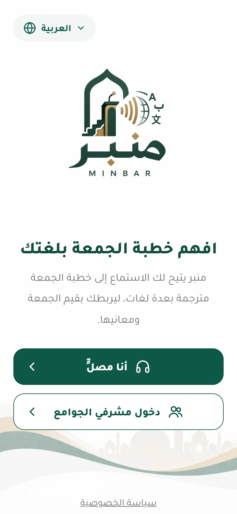<br><sub><b>Home</b></sub></td>
    <td align="center" width="25%">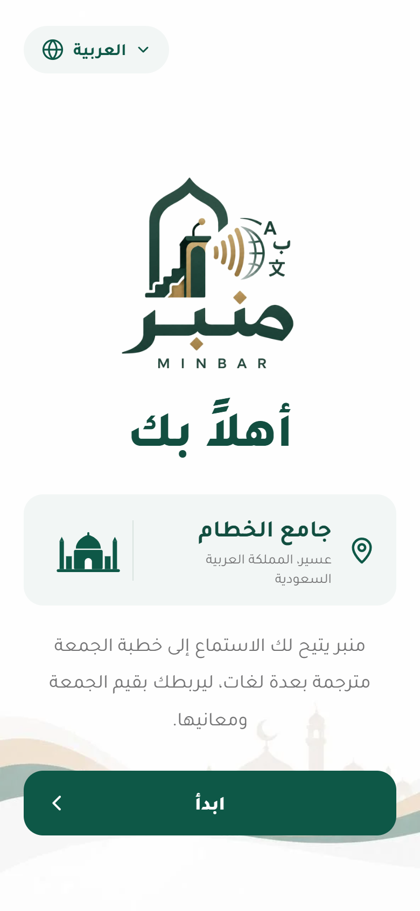<br><sub><b>Welcome</b> · mosque name, rotating greeting</sub></td>
    <td align="center" width="25%">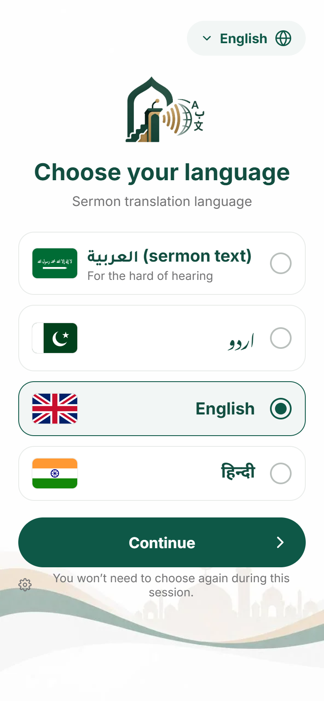<br><sub><b>Sermon language</b> · Arabic text, Urdu, English, Hindi</sub></td>
    <td align="center" width="25%">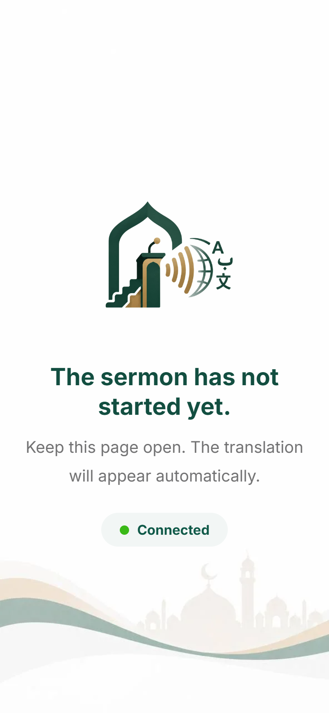<br><sub><b>Waiting</b> · connected, before the sermon</sub></td>
  </tr>
  <tr>
    <td align="center">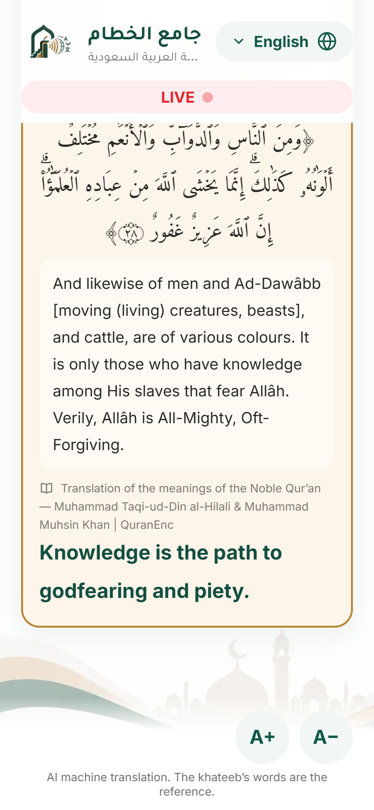<br><sub><b>Live · English</b> · verified Quran card</sub></td>
    <td align="center">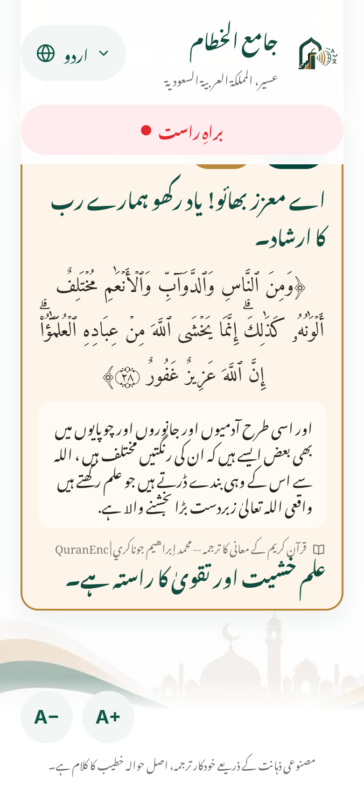<br><sub><b>Live · Urdu</b> · right-to-left</sub></td>
    <td align="center">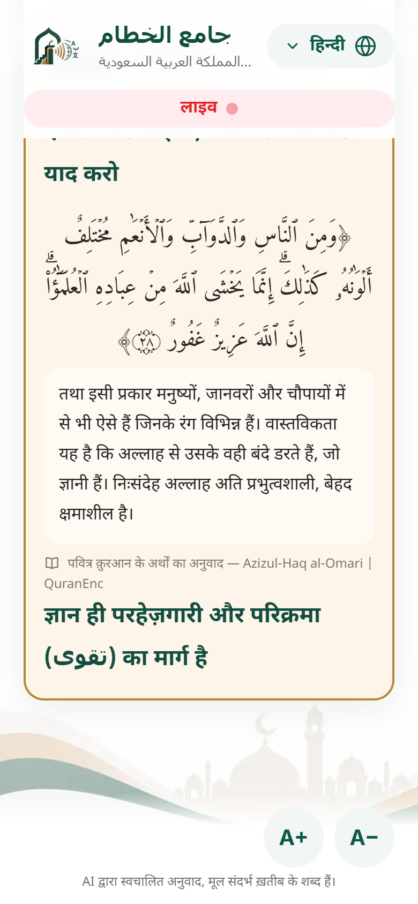<br><sub><b>Live · Hindi</b></sub></td>
    <td align="center">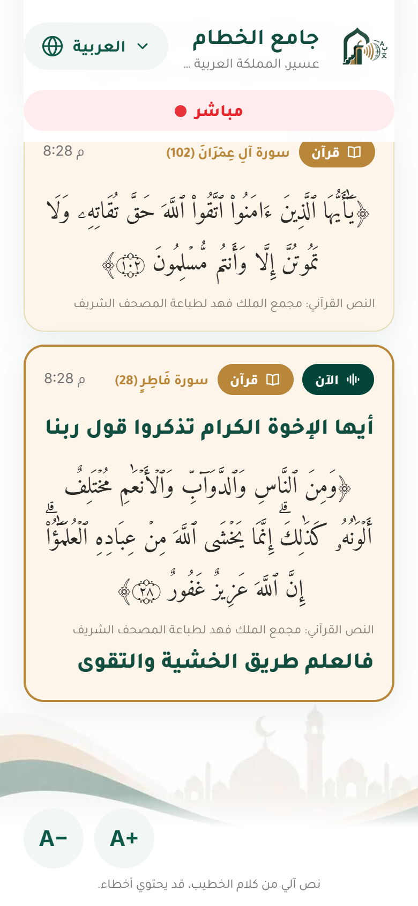<br><sub><b>Arabic text</b> · for hearing-impaired worshippers</sub></td>
  </tr>
  <tr>
    <td align="center">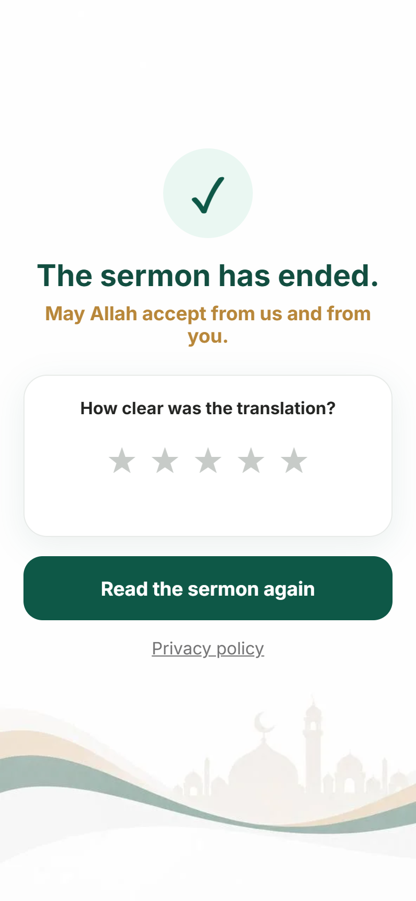<br><sub><b>Sermon ended</b> · clarity rating (stays on device)</sub></td>
    <td align="center">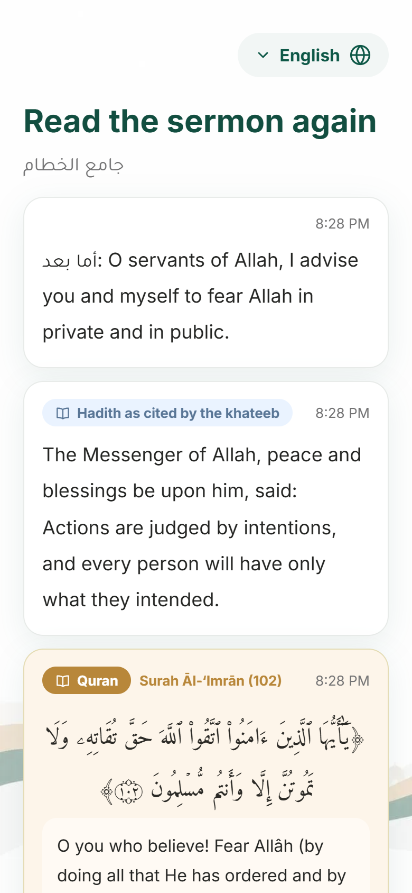<br><sub><b>Replay</b> · full sermon</sub></td>
    <td align="center">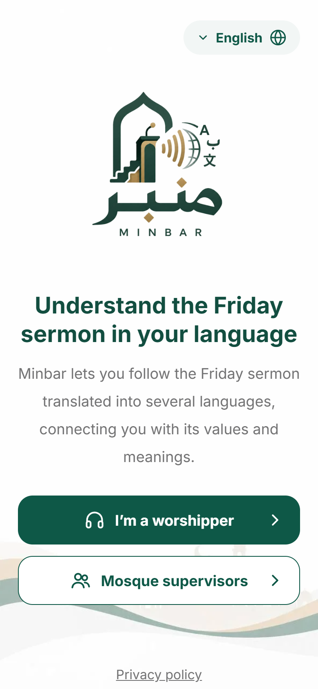<br><sub><b>English interface</b> · language menu</sub></td>
    <td align="center">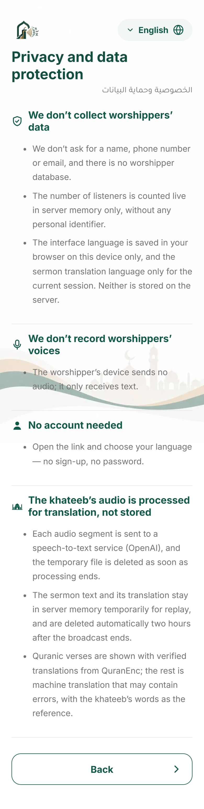<br><sub><b>Privacy</b></sub></td>
  </tr>
</table>

### Mosque supervisor

<table>
  <tr>
    <td align="center" width="25%">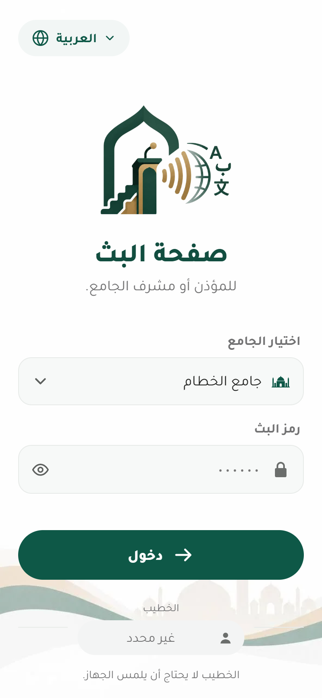<br><sub><b>Login</b> · mosque + secret code</sub></td>
    <td align="center" width="25%">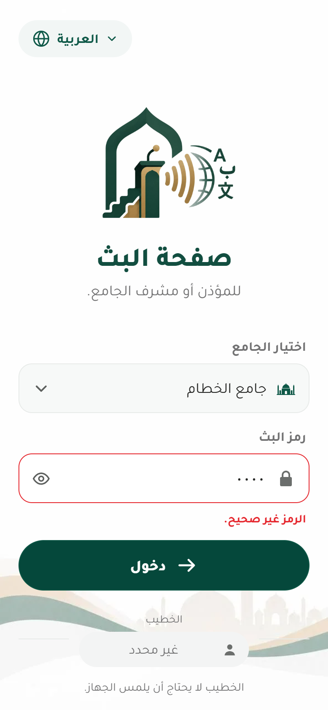<br><sub><b>Error state</b> · wrong broadcast code</sub></td>
    <td align="center" width="25%">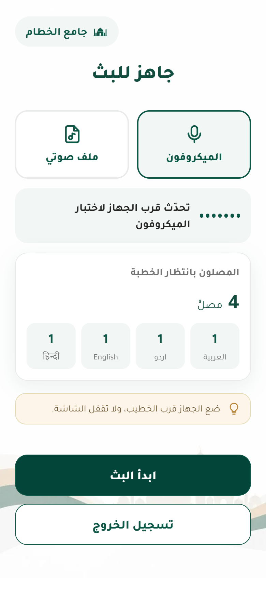<br><sub><b>Ready</b> · microphone check, listeners per language</sub></td>
    <td align="center" width="25%">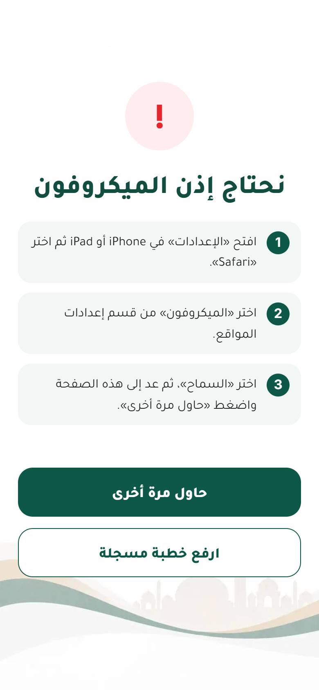<br><sub><b>Microphone permission</b> · guided steps</sub></td>
  </tr>
  <tr>
    <td align="center">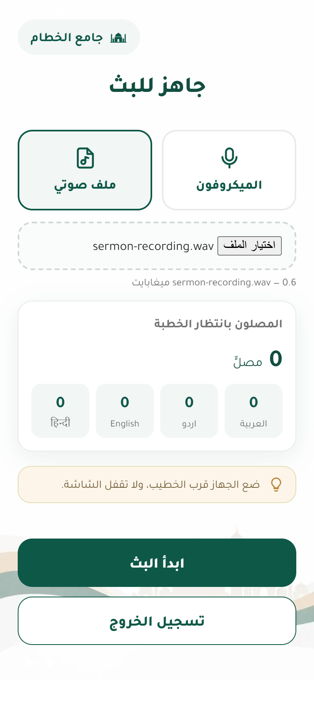<br><sub><b>Recorded sermon</b> · file upload</sub></td>
    <td align="center">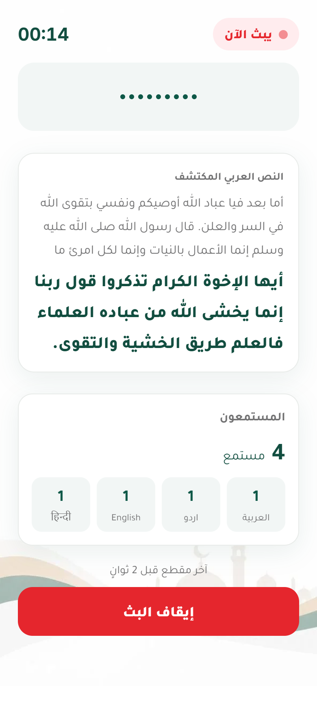<br><sub><b>Broadcasting</b> · detected Arabic, live listeners</sub></td>
    <td align="center">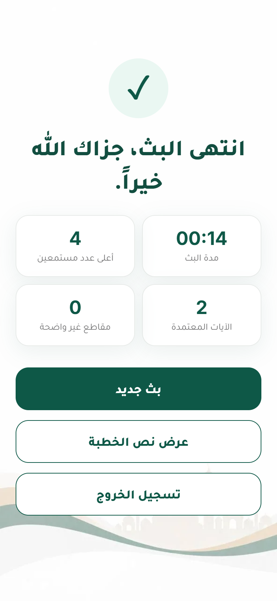<br><sub><b>Broadcast ended</b> · statistics</sub></td>
    <td align="center">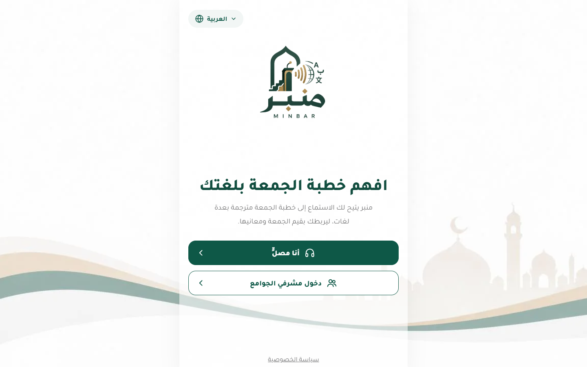<br><sub><b>Desktop layout</b></sub></td>
  </tr>
</table>

---

## Overview

### The problem

The Friday sermon is the weekly address of the mosque. In many mosques a large share of worshippers do not understand Arabic: they attend, but the message does not reach them. Hearing-impaired worshippers face the same barrier even when Arabic is their language. And general-purpose machine translation is not appropriate for Quranic verses, whose translations must come from recognised, attributable sources.

### The solution

A mosque supervisor places a phone or tablet near the khateeb and starts a broadcast. Minbar converts the Arabic speech to text, splits it into sentences and checks each one against the Quran text. **Quranic verses** are shown with their verified QuranEnc translation; **the khateeb's own words** are translated by AI with guidance from a glossary of religious terms. Worshippers open a link, choose a language and follow the sermon live on their own phone. Nothing is required from the khateeb, and nothing from the worshipper beyond the link.

---

## Key Features

| | Feature | What it does |
|---|---|---|
| 🎙️ | **Live broadcasting** | Microphone in chunks of 6 s, or a recorded sermon published as a live feed |
| 🗣️ | **Arabic speech-to-text** | OpenAI transcription, silence-artefact filtering, sentence segmentation |
| 📖 | **Quran verse detection** | Deterministic matching against all 6,236 verses, including partial quotations inside the khateeb's sentences |
| ✅ | **Verified Quran translations** | QuranEnc translations shown verbatim with translator and version |
| 🌐 | **Translation of the khateeb's words** | English, Urdu and Hindi in parallel, with glossary guidance |
| 🔤 | **Four-language interface** | Arabic, English, Urdu, Hindi; RTL/LTR switches instantly, independent of the sermon language |
| ⚡ | **Realtime delivery** | WebSocket, sentences published in sermon order |
| 📶 | **Reconnection** | Automatic; missed sentences delivered once, without duplicates |
| 👥 | **Listener counts per language** | Live, for the supervisor; no identity attached |
| 🔄 | **Broadcast states** | `READY → LIVE → ENDED`, takeover from another device |
| 📜 | **Replay** | The full sermon can be re-read while the server keeps it (2 hours after the end by default) |
| 🔒 | **Privacy by design** | No worshipper accounts, database or personal data; sermon audio processed temporarily |

---

## User Flow

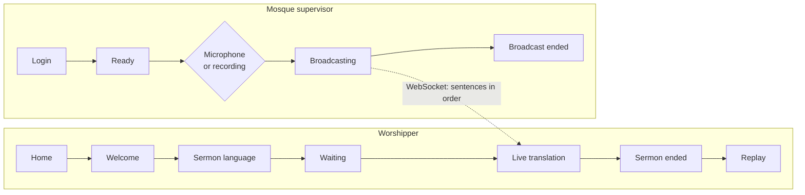

Handled states include: wrong broadcast code, microphone permission denied, page not on HTTPS, broadcast already live (continue on this device), network disconnect and reconnect, unclear audio, missing or invalid OpenAI key, empty / unsupported / oversized files. Details: [docs/ARCHITECTURE.md](docs/ARCHITECTURE.md).

---

## AI Methodology

| Task | Method | AI? |
|---|---|---|
| Arabic speech-to-text | OpenAI transcription (`whisper-1` by default), `language="ar"` | Yes |
| Silence artefacts, unclear output | Rule-based filter | No |
| Sentence segmentation | Punctuation, length and chunk-count rules | No |
| Quran verse detection | Deterministic fuzzy matching on normalised Quran text | **No** |
| Quran verse translation | Verbatim QuranEnc lookup | **No** |
| Translation of the khateeb's words | OpenAI Responses API (`gpt-5-mini` by default) | Yes |
| Religious terminology | Glossary terms passed to the model, output checked | Hint only |
| Hadith label | Phrase markers; the hadith itself is not verified | No |

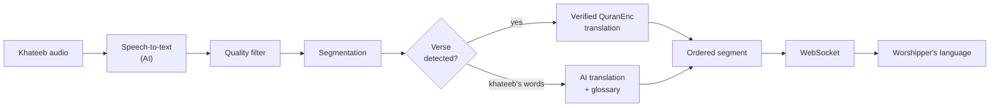

Full explanation, including failure behaviour: [docs/AI.md](docs/AI.md).

---

## Religious-Content Safety

- **Verses bypass the AI translation path.** Detection is deterministic (RapidFuzz `partial_ratio` ≥ 90 on text normalised for diacritics and letter variants). A detected verse is shown in Uthmani script with its QuranEnc translation, copied verbatim, with source, translator and version on the card.
- **Quotations inside commentary** are found with a word-shingle index; when the khateeb quotes a verse within his own sentence, only his surrounding words go to the AI.
- **Common Quranic phrases are not presented as citations.** A short fragment is accepted only when it is distinctive (it covers half the verse, is at least 7 words, or occurs in a single verse). In evaluation, 12 common sermon sentences produced 0 false detections.
- **Verified translations are delivered even when AI fails.**
- **AI translation is labelled** on every live screen as machine translation, with the khateeb's words as the reference.
- **Hadith are not verified.** The badge reads "Hadith as cited by the khateeb".
- **Human review is still needed**: the glossary has no formal religious review yet, and AI translations should be sample-reviewed by native speakers before regular use ([docs/AI.md §10](docs/AI.md#10-human-review)).

---

## Multilingual Support

| Language | Code | Direction | Quranic verses | Khateeb's words | Interface |
|---|---|---|---|---|---|
| **Arabic** | `ar` | RTL | Uthmani text | Arabic transcript (for hearing-impaired worshippers) | ✅ |
| **English** | `en` | LTR | QuranEnc: al-Hilali & Khan | AI translation | ✅ |
| **Urdu** | `ur` | RTL | QuranEnc: Junagarhi | AI translation | ✅ |
| **Hindi** | `hi` | LTR | QuranEnc: Azizul-Haq al-Omari | AI translation | ✅ |

Two independent choices:

- **Sermon language** (per tab, `sessionStorage`): what the sermon cards show. Each card keeps its own script direction.
- **Interface language** (on the device, `localStorage`): menus, buttons, statuses and error messages, from one hand-written dictionary ([`frontend/js/i18n.js`](frontend/js/i18n.js)). Switching updates text and direction in place, without reloading. Server errors are translated by error code.

---

## Accessibility

- **Arabic sermon text** for hearing-impaired worshippers, as a sermon-language option.
- **Adjustable text size** (A+ / A−) on the live screen.
- **Correct script direction** per language and per card (RTL for Arabic and Urdu, LTR for English and Hindi), with fonts for each script (Tajawal, Noto Nastaliq Urdu, Noto Sans Devanagari, Amiri Quran for verses).
- **No typing for worshippers**: open the link, pick a language.
- **Keyboard and assistive-technology support**: visible focus outlines, `aria-label`s on icon buttons, a keyboard-navigable language menu, `aria-live` on the sermon feed and status line.
- **Reduced motion** is respected (`prefers-reduced-motion`).
- **Responsive layout** for phones, tablets and desktops.

---

## Privacy

| Principle | Implementation |
|---|---|
| **No worshipper accounts** | `/listen` needs only a link |
| **No worshipper database** | There is no database; room state is in server memory |
| **No personal information** | A listener is an open WebSocket and a language code; no name, phone, email or IP is stored |
| **No worshipper audio** | Worshipper pages never request the microphone |
| **Temporary sermon audio** | Each upload is a temporary file for one transcription request, deleted in a `finally` block |
| **Ephemeral state** | Listener counts are derived from open sockets; transcripts are cleared 2 hours after the broadcast ends (configurable) or on restart |
| **Local preferences only** | Interface language in `localStorage`, sermon language in `sessionStorage`; neither is stored on the server |
| **Minimal logging** | Standard output only; transcript text is never logged |

Details and security controls: [docs/PRIVACY.md](docs/PRIVACY.md).

---

## Technical Architecture

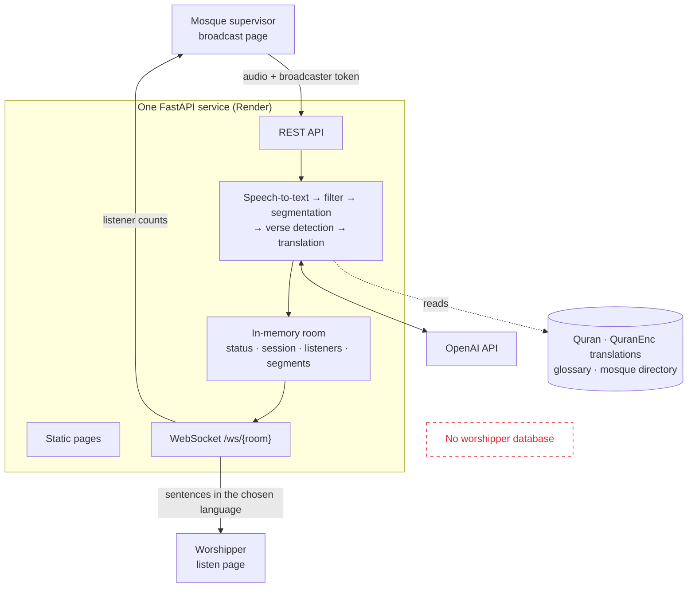

- One process serves pages, REST and WebSocket on one origin; pages use `wss://` automatically on HTTPS.
- Rooms exist only for mosques in [`data/mosques.json`](data/mosques.json); broadcast codes are secret environment values.
- Sentences are built concurrently and published strictly in order; work from an older session is discarded.
- Reconnecting clients receive only what they missed in the same session.

Details: [docs/ARCHITECTURE.md](docs/ARCHITECTURE.md) · API and message formats: [docs/API.md](docs/API.md).

---

## Technology Stack

| Area | Technologies |
|---|---|
| **Frontend** | HTML, CSS, vanilla JavaScript (no build step), SVG icon sprite, Google Fonts |
| **Backend** | Python, FastAPI, Uvicorn, Pydantic, python-multipart, python-dotenv |
| **AI** | OpenAI Python SDK: audio transcription and Responses API |
| **Realtime** | WebSockets (FastAPI/Starlette) |
| **Quran matching & validation** | RapidFuzz; glossary checks (`validate.py`) |
| **Data** | King Fahd Complex Quran JSON, QuranEnc translation JSON, glossary JSON, mosque directory JSON |
| **Deployment** | Render Blueprint (`render.yaml`), Docker (`Dockerfile`) |
| **Testing** | pytest, HTTPX/TestClient; Playwright browser suites |

---

## Project Structure

```text
main.py              FastAPI app, pages, security headers
api/                 HTTP endpoints (broadcast, live audio, transcription, translation, health)
realtime/            in-memory rooms and the WebSocket protocol
services/            speech-to-text, segmentation, verse detection, translation, pipeline, config
verses.py            normalisation, verse matching, translation lookup
validate.py          glossary checks
frontend/            index, listen, broadcast, privacy pages; i18n; styles; assets
data/                Quran text, QuranEnc translations, glossary, mosque directory
tests/               pytest suite and Playwright browser suites
scripts/             evaluation on real sermon recordings
docs/                documentation, screenshots, design references
```

Every file explained: [docs/PROJECT_MAP.md](docs/PROJECT_MAP.md).

---

## Sources

| Data | Source | File |
|---|---|---|
| Quran text (Hafs, v30) | King Fahd Glorious Qur'an Printing Complex | `data/kfgqpc_hafs_v30.json` |
| English translation | QuranEnc: al-Hilali & Muhsin Khan, v1.1.2 | `data/translations/en.json` |
| Urdu translation | QuranEnc: Muhammad Ibrahim Junagarhi, v1.1.3 | `data/translations/ur.json` |
| Hindi translation | QuranEnc: Azizul-Haq al-Omari, v1.1.5 | `data/translations/hi.json` |
| Terminology glossary | Challenge scientific reference pack; to be completed from the Al-Jamhara dictionary | `data/glossary.json` |

Verification (published SHA-256, 6,236 verses, key alignment, conversion rules): [docs/SOURCES.md](docs/SOURCES.md).

---

## Local Setup

```bash
git clone https://github.com/arwaasirii2006-coder/minbar.git
cd minbar
python -m venv .venv
source .venv/bin/activate          # Windows: .venv\Scripts\activate
pip install -r requirements.txt
cp .env.example .env               # Windows: copy .env.example .env
# edit .env: OPENAI_API_KEY and MINBAR_BROADCAST_CODES=KHATAM-2026=choose-a-code
uvicorn main:app --reload --host 127.0.0.1 --port 8000
```

| Page | URL |
|---|---|
| Home | http://127.0.0.1:8000/ |
| Worshipper | http://127.0.0.1:8000/listen |
| Mosque supervisor | http://127.0.0.1:8000/broadcast |
| Readiness | http://127.0.0.1:8000/ready |

The microphone works on `localhost` or over HTTPS. Without an OpenAI key the app still runs (rooms, WebSocket, Quran detection, verified translations), but an audio broadcast cannot start. Step-by-step guide: [docs/QUICKSTART.md](docs/QUICKSTART.md).

---

## Environment Variables

| Variable | Required | Purpose |
|---|---|---|
| `OPENAI_API_KEY` | For audio broadcasts; in production | Speech-to-text and AI translation |
| `MINBAR_BROADCAST_CODES` | In production | Secret code per mosque: `ROOM_ID=CODE,…` |
| `MINBAR_ENV` | No (`development`) | `production` enforces the key and codes for `/ready`, disables `/docs`, restricts paid AI endpoints and development CORS |
| `MINBAR_ALLOWED_ORIGINS` | No | Extra CORS origins (not needed for same-origin pages) |

Optional tuning (upload limit, replay retention, chunk length, models, timeouts, log level) is listed in [`.env.example`](.env.example) and [docs/QUICKSTART.md](docs/QUICKSTART.md#environment-variables). Never commit `.env`.

---

## Testing

```bash
pip install -r requirements.txt
pytest -q
```

| Suite | Result |
|---|---|
| pytest (`tests/test_*.py`) | **111 passed** |
| Browser: worshipper + supervisor regression | **39/39** |
| Browser: four interface languages | **81/81** |
| Browser: separate dev server, invalid key | **15/15** |
| Browser: separate dev server, no key | **12/12** |

Quran detection evaluation: 150 random verse fragments embedded in sermon sentences → 149 correct, 1 matched a different verse, 0 missed; 12 common non-verse sermon sentences → 0 false detections.

The automated tests do not call OpenAI. **Real-sermon evaluation (speech-to-text accuracy, translation quality, latency) is not done yet**; the method and script are in [docs/TESTING.md](docs/TESTING.md#5-evaluation-on-real-sermon-recordings).

---

## Deployment

Minbar runs as one web service on **Render**, defined by [`render.yaml`](render.yaml) (native Python runtime, single instance, health check `/ready`). A [`Dockerfile`](Dockerfile) is provided for container hosts.

- **Live demo:** https://minbar-9kye.onrender.com
- Secrets (`OPENAI_API_KEY`, `MINBAR_BROADCAST_CODES`) are entered in the Render dashboard, never in the repository.
- In production, `/ready` stays unhealthy until both secrets are set.
- Room state is in memory: keep one instance and avoid redeploying during a sermon.

Guide: [docs/DEPLOYMENT.md](docs/DEPLOYMENT.md).

---

## Demo

1. Open **[/broadcast](https://minbar-9kye.onrender.com/broadcast)**, select **جامع الخطام**, enter the broadcast code and sign in.
2. On a second device open **[/listen](https://minbar-9kye.onrender.com/listen)**, press Start and choose English, Urdu, Hindi or Arabic text.
3. Start the broadcast and read a sentence with a verse, for example «قال تعالى يا أيها الذين آمنوا اتقوا الله حق تقاته ولا تموتن إلا وأنتم مسلمون».
4. The worshipper sees a gold Quran card with the Uthmani verse and the verified translation; the khateeb's other words appear as machine-translated cards.
5. Stop the broadcast; the worshipper can read the whole sermon again.

On the live demo, the first load after an idle period can take around half a minute. A two-minute script with recovery steps: [docs/DEMO.md](docs/DEMO.md).

---

## Limitations

- **Real-audio benchmark pending.** Speech-to-text accuracy, AI translation quality and end-to-end latency on real sermon recordings have not been measured yet.
- **Machine translation can be wrong**; it is always labelled as such. Output is not post-edited.
- **Verse detection depends on transcription.** A heavily mis-transcribed verse may go undetected; in evaluation 1 of 150 embedded fragments matched a different verse.
- **Partial quotation of a long verse** shows the translation of the whole verse.
- **Glossary:** 10 terms, English renderings only (Urdu/Hindi pending an approved source), no formal religious review yet.
- **Hadith are not verified.**
- **In-memory state, single instance:** a restart ends a live broadcast and clears replay transcripts.
- **Recorded sermons** are limited to 25 MB per file.
- **Live audio** is sent as short complete files, not through a streaming recognition connection, which adds a few seconds of delay.
- **No request rate limiting** in the application.

---

## Future Expansion

Directions that follow from the documented limitations:

- Run the real-sermon evaluation with [`scripts/evaluate_sermons.py`](scripts/evaluate_sermons.py) and publish the results.
- Complete Urdu and Hindi glossary renderings from an approved source and obtain a formal religious review.
- Native-speaker review of AI translations per language.
- More mosques: each is one entry in `data/mosques.json` plus a code in `MINBAR_BROADCAST_CODES`.
- A streaming speech-recognition provider behind `services/speech_to_text.py` to reduce delay; the listener contract does not depend on how audio is captured.
- Hosting-level rate limiting for the public deployment.

---

## Documentation

| Document | Contents |
|---|---|
| [QUICKSTART.md](docs/QUICKSTART.md) | Install, configure, run, first broadcast |
| [ARCHITECTURE.md](docs/ARCHITECTURE.md) | Components, request path, session model, realtime delivery |
| [AI.md](docs/AI.md) | AI methodology, Quran detection, glossary, failures, limitations |
| [SOURCES.md](docs/SOURCES.md) | Content sources and verification |
| [PRIVACY.md](docs/PRIVACY.md) | Data handling and security controls |
| [API.md](docs/API.md) | HTTP endpoints and WebSocket messages |
| [DEPLOYMENT.md](docs/DEPLOYMENT.md) | Render, Docker, live demo |
| [TESTING.md](docs/TESTING.md) | Test suites, results, evaluation method |
| [DEMO.md](docs/DEMO.md) | Two-minute demo script |
| [PROJECT_MAP.md](docs/PROJECT_MAP.md) | Every file and where to look |
| [TROUBLESHOOTING.md](docs/TROUBLESHOOTING.md) | Symptom → cause → fix |

---

## License

Released under the [MIT License](LICENSE).
