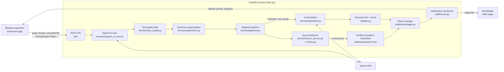

# Architecture

This document describes the system as it is implemented in this repository. Every component named here exists in the code; file references are given so each claim can be checked.

## 1. Overview

Minbar is **one FastAPI process** that serves the static frontend, the REST API and the WebSocket on the same origin. There is **no database**: broadcast state lives in the memory of that process.



The worshipper never sends audio. Worshipper devices only open a WebSocket and receive text.

## 2. Request path, step by step

| # | Step | Where | What happens |
|---|---|---|---|
| 1 | Capture | `frontend/broadcast.html` | The supervisor page restarts `MediaRecorder` every `chunk_seconds` (default 6 s, from `MINBAR_CHUNK_SECONDS`), so every chunk is a complete, independently decodable audio file. A recorded sermon is uploaded as one file instead. |
| 2 | Ingestion | `api/live_audio.py` | `POST /live/{room}/audio` (one chunk) or `POST /live/{room}/recorded` (whole file, answered `202` and processed in the background). Both require `X-Broadcaster-Token` and a `LIVE` room. `POST /live/{room}/text` accepts Arabic text directly and joins the same pipeline after speech-to-text. |
| 3 | Validation | `services/speech_to_text.py` | `read_upload` stops reading once the size limit (`MINBAR_MAX_UPLOAD_BYTES`, 25 MB) is exceeded. `validate_audio` checks the extension or MIME type against an allow-list and rejects blobs under 1 KB as empty. |
| 4 | Speech-to-text | `services/speech_to_text.py` | The bytes are written to a temporary file, sent to the OpenAI transcription endpoint with `language="ar"` (model `MINBAR_STT_MODEL`, default `whisper-1`), and the file is deleted in a `finally` block. |
| 5 | Quality filter | `services/text_quality.py` | Known speech-to-text silence artefacts (subtitle phrases such as «اشتركوا في القناة») are removed. Output with no letters is `empty` (dropped). Output with fewer than 4 Arabic letters, or under 60 % Arabic letters, becomes an `unclear` segment. |
| 6 | Segmentation | `services/segmenter.py`, `realtime/manager.py` | Text is buffered per room and cut at Arabic/Latin sentence punctuation (`. ! ؟ ? ؛ ;` and newline). Text longer than 260 characters is cut at a space. If no sentence ends within `MINBAR_LIVE_FLUSH_CHUNKS` chunks (default 2), the buffer is published anyway. |
| 7 | Quran detection | `services/verse_service.py`, `verses.py` | Deterministic matching against the 6,236 verses (see [AI.md](AI.md#4-quran-detection-no-ai)). |
| 8 | Translation | `services/pipeline.py`, `services/translator.py` | For each of `en`, `ur`, `hi` in parallel: a detected verse takes its verified QuranEnc translation verbatim; the khateeb's own words (including commentary before and after a quoted verse) are translated by the OpenAI model `MINBAR_TRANSLATION_MODEL` (default `gpt-5-mini`). |
| 9 | Terminology check | `validate.py` | Glossary terms present in the Arabic are passed to the model as approved renderings, and the output is checked; missing terms are reported as `glossary_warnings`. |
| 10 | Ordered publishing | `realtime/manager.py` | Each sentence is an asyncio task. Building runs concurrently, publishing waits for the previous task, so worshippers always see sermon order. |
| 11 | Delivery | `realtime/ws.py` | The segment (Arabic, verse data, all three translations) is sent to every socket in the room. Each worshipper page renders the language it selected. |

Hadith: if no verse is detected and the sentence contains a marker such as «قال رسول الله», the segment is labelled `is_hadith` ("Hadith as cited by the khateeb"). The hadith itself is **not** verified.

## 3. Session model

A **room** is a mosque from `data/mosques.json` (currently one: `KHATAM-2026`, جامع الخطام). Rooms are created lazily in memory on first access; ids that are not in the directory return `404` / WebSocket close `4404`, so clients cannot create rooms.

| Field (`realtime/manager.py` `Room`) | Meaning |
|---|---|
| `status` | `READY`, `LIVE` or `ENDED` |
| `session` | Integer incremented on every start. Work that finishes after a newer session started is discarded. |
| `broadcaster_token` | Random `secrets.token_urlsafe(24)`, issued on start and on takeover; compared in constant time |
| `clients` | Open WebSockets with role (`listener`/`broadcaster`) and language. No identity, no IP stored |
| `segments` | Published segments of the current session (capped at 2,000) |
| `peak_listeners`, `verified_verses`, `unclear_segments` | Statistics shown to the supervisor when the broadcast ends |
| `processing` | Progress of a recorded-sermon upload (`processing` / `done` / `failed`, step, counts) |

### Broadcast state

```text
READY ──start──▶ LIVE ──stop──▶ ENDED ──(MINBAR_ROOM_TTL_SECONDS)──▶ READY
                  ▲                │
                  └──── start ─────┘   new session; previous segments cleared
```

- **Start** (`POST /broadcast/start`) checks the mosque's broadcast code from `MINBAR_BROADCAST_CODES`, increments `session`, issues a token and sends `started` to connected listeners.
- **Already live**: a second start returns `409 already_live`. The page offers to continue on this device; `resume: true` issues a **new token**, so the previous device's next request gets `401` and it shows "session moved".
- **Stop** (`POST /broadcast/{room}/stop`) flushes the segmenter, waits up to 45 s for in-flight segments, sets `ENDED` and sends `ended` with statistics to every socket.
- **Expiry**: an `ENDED` room is reset to `READY` (segments, khateeb name and token cleared) the next time it is accessed after `MINBAR_ROOM_TTL_SECONDS` (default 7,200 s = 2 h). A process restart clears everything immediately.

## 4. Realtime delivery

WebSocket: `GET /ws/{room_id}?role=listener|broadcaster&language=ar|en|ur|hi&token=…&since=…&session=…`

| Server → client | Purpose |
|---|---|
| `state` | Room state on connect |
| `history` | Segments the client has not seen (see reconnect) |
| `started`, `ended` | Broadcast lifecycle |
| `segment` | One published sentence |
| `listeners` | Broadcaster only: total, per-language counts, peak |
| `processing` | Broadcaster only: recorded-sermon progress |
| `error` | `unknown_room`, `unauthorized`, `unsupported_language` |
| `pong` | Reply to `ping` |

Clients send `{"type":"ping"}` every 25 s and listeners may send `{"type":"language","language":"ur"}` to switch language without reconnecting. A broadcaster socket requires a valid token on a `LIVE` room, otherwise it is closed with `4401`. Full message formats: [API.md](API.md).

### Reconnect

- The listener page reconnects automatically with exponential backoff (1 s doubling to a 15 s cap, plus jitter), and immediately when the browser reports it is back online or the tab becomes visible again.
- On reconnect it sends `since` (last `seq` received) and `session`. If the session matches, the server sends only segments with a higher `seq`; otherwise it sends the whole current session. History is capped at the latest 300 segments.
- While disconnected, the page shows a banner and fades earlier cards; it does not lose or duplicate segments.
- The supervisor page queues audio chunks while offline (at most 30; the oldest is dropped beyond that), retries a chunk twice on `5xx` (1.5 s, then 3 s), stops recording on `503` (speech service not configured or key rejected, which retrying cannot fix), and returns to the login/ready flow on `401`/`409` (session taken over or ended). Its own WebSocket also reconnects with backoff.

### Segment ordering

`RoomManager._chain` links every segment task to the previous one (`room.tail`). Translation for sentence *n+1* may finish before sentence *n*, but it is only published after *n* is published. Each payload gets `seq` (1, 2, 3, …) and `id` = `{room}-{session}-{seq}`. Payloads built for an older session or after the room left `LIVE` are dropped. Recorded sermons are published with a 0.35 s pause between segments so listeners can follow.

### Listener counts

Counts are derived from the open sockets at the moment they are needed (`Room.language_counts`) and pushed to broadcaster sockets on every connect, disconnect and language change. Nothing about a listener is stored beyond the open socket and its language code.

### Failure isolation

- A translation failure in one language marks only that language in `failed_languages`; the Arabic text, the other languages and any verified verse translation are still delivered.
- A speech-to-text failure fails that chunk only; the room stays `LIVE`.
- An exception while building a segment is logged and the segment is skipped; the chain continues.
- A global exception handler (`main.py`) returns a JSON `500` instead of crashing the process.

## 5. Ephemeral state

| Data | Where | Lifetime |
|---|---|---|
| Sermon audio | Temporary file on the server | One transcription request; deleted in `finally` |
| Recorded sermon bytes | Process memory | Until transcription finishes |
| Transcript segments | Process memory (`Room.segments`) | Until the next start, TTL expiry after the end (2 h default), or restart |
| Listener sockets and languages | Process memory | While the socket is open |
| Interface language | Worshipper's browser `localStorage` (`minbar.ui`) | On that device only |
| Sermon language | Worshipper's browser `sessionStorage` (`minbar.lang`) | Until the tab closes |

Because state is in memory, the service must run as **a single instance** (`numInstances: 1` in `render.yaml`). A restart or redeploy ends a live broadcast.

## 6. Frontend

Plain HTML, CSS and JavaScript with no build step (`frontend/`). `frontend/js/config.js` resolves the API base: same origin by default, or an `?api=` parameter (kept in `sessionStorage` for the tab) when pages are served by a separate static server. `frontend/js/i18n.js` holds the interface strings for Arabic, English, Urdu and Hindi; the interface language is independent from the sermon language the worshipper reads. All server text is inserted with `textContent`, never as HTML.

## 7. Security controls

See [PRIVACY.md](PRIVACY.md#security-controls) for headers, CORS, authentication and input limits.

## 8. Known architectural limits

- Live audio is sent as short complete files rather than over a streaming speech-recognition connection, which adds a few seconds of latency per sentence.
- In-memory state means one instance and no persistence across restarts (by design for privacy, but it also means no horizontal scaling).
- There is no request rate limiting in the application; see [PRIVACY.md](PRIVACY.md#what-is-not-implemented).
